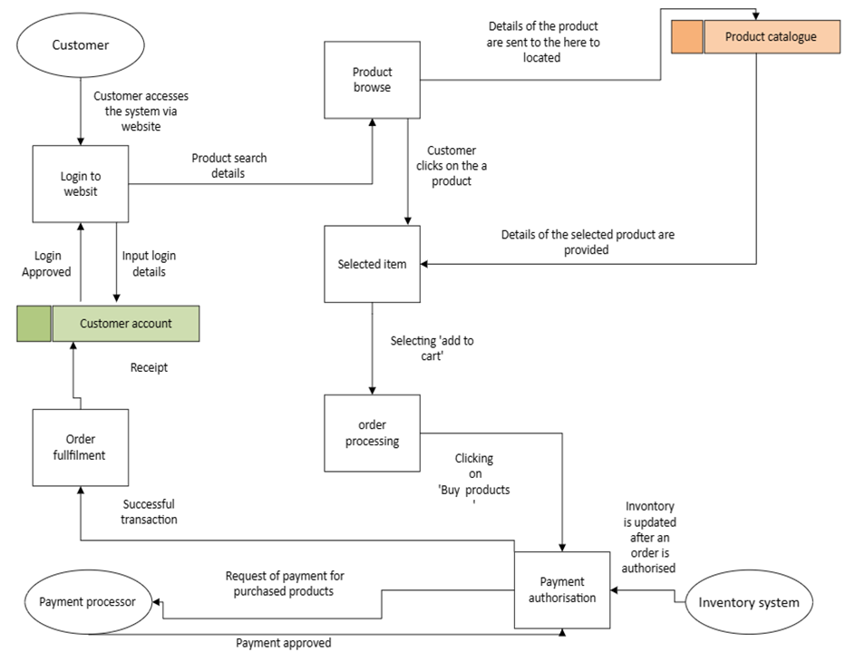
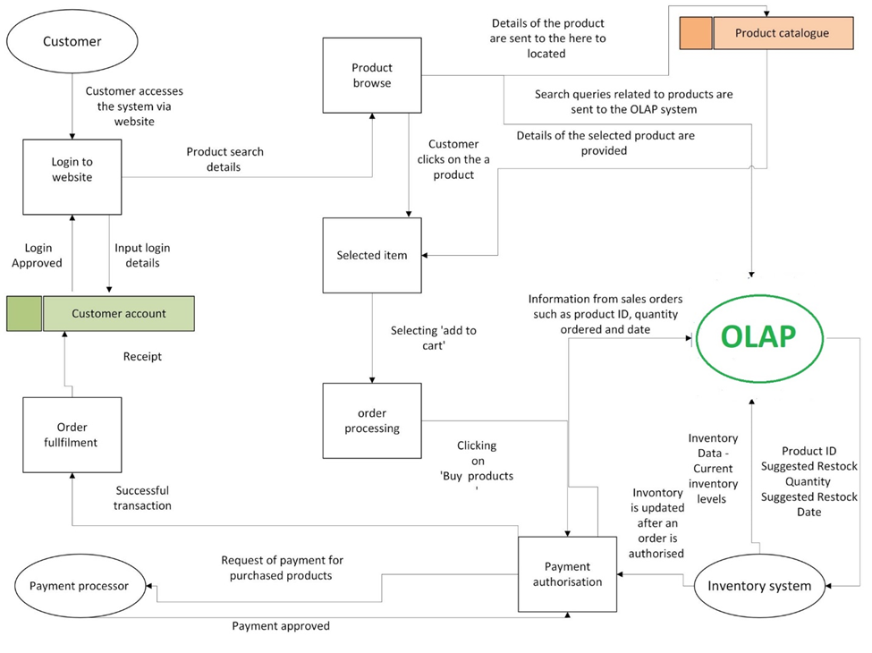
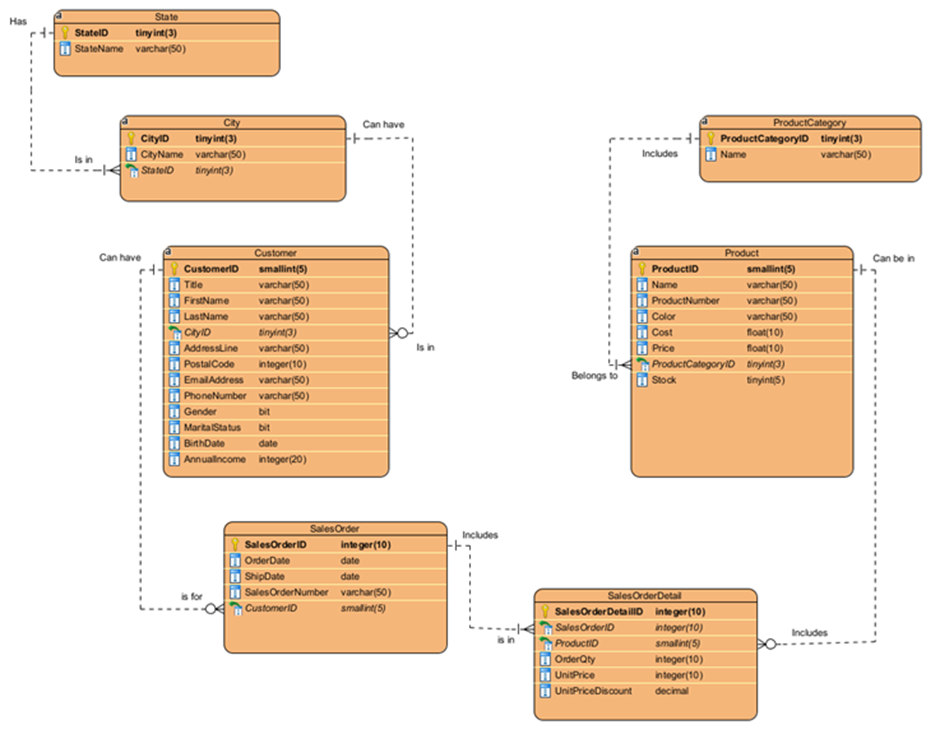

# Digikala Data Management Evaluation and SQL Prototype

## Overview
This project critically evaluates the data management practices of **Digikala**, a leading online shopping platform, and proposes solutions to improve its operations. The project focuses on optimising data flow and enhancing inventory management by integrating an **OLAP system** for real-time analytics. A **Data Flow Diagram (DFD)** and an **Entity-Relationship Diagram (ERD)** were created to represent the current and proposed systems. Additionally, a fully implemented **SQL-based prototype** was built, including 8 queries to generate strategic reports and insights.

## Main Report
The complete evaluation and analysis are available in the detailed report here: [Digikala Data Management Evaluation Report](Digikala_Data_Management_Evaluation_Report.pdf).

## Problem Statement
Digikala faces challenges in managing inventory during high-demand periods and promotional events. To address this, the project recommends implementing an OLAP system to forecast demand and adjust inventory levels dynamically. This will enable Digikala to:
- Monitor customer behaviour
- Improve inventory replenishment
- Optimise supply chain operations

## Key Components

### 1. Data Management Practices
The project evaluates various aspects of Digikala’s data management, such as:
- **Data Integration**: Consolidating customer, product, and sales data for streamlined processes.
- **Data Interoperability**: Ensuring seamless data exchange between the online shopping platform and the inventory system.
- **Data Flow Optimization**: Implementing automated, real-time analytics to proactively manage inventory.

### 2. Data Flow Diagrams (DFD)
- **Context Diagram (As Is)**: Shows how Digikala currently handles customer interactions, payment processing, and inventory management.
- **Level 0 DFD (As Is)**: Visualises the data flow for key processes like order fulfilment, payment processing, and inventory updates.
  
  
  
- **Context Diagram (To Be)**: Introduces an OLAP system to enable better inventory forecasting.
- **Level 0 DFD (To Be)**: Displays how real-time analytics will provide restocking recommendations to improve inventory management.

  

### 3. Entity-Relationship Diagram (ERD)
The **ERD** details the relationships between key entities like customers, products, sales orders, and inventory. This design supports efficient queries for data analysis and reporting.

  

### 4. SQL-Based Prototype
The SQL build implements the ERD, featuring all the necessary tables and sample data. Additionally, the following 8 queries were designed to generate valuable reports and insights:
- **Query 1**: Analyse Customer Lifetime Value (CLTV) Segmentation by Demographics.
- **Query 2**: Analyse the effect of discounts on quantity sold.
- **Query 3**: Track Sales Trends Over Time (Monthly).
- **Query 4**: Identify Top 2 Best-Selling Products in each Product Category.
- **Query 5**: Identify products with Low Stock Levels but High Demand from High-Value Customers.
- **Query 6**: Identify At-Risk Customers and Customer Churn.
- **Query 7**: Analyse Delivery Lead Time and City Profitability Trends.
- **Query 8**: Perform Customer Demography Analysis to identify effective segments for acquiring new customers.

### 5. SQL Files
- **`Create_Database_DigiKala.sql`**: Script to create the Digikala database.
- **`Create_Tables.sql`**: Script to create the necessary tables based on the ERD.
- **`Populate_Tables.sql`**: Script to populate the tables with sample data.
- **`DigiKala_DB_Backup.sql`**: Backup file for the entire Digikala database.

## Datasets
The **datasets** used in this project include information on cities, customers, products, product categories, sales orders, and states.

- **City.csv**: Contains data about cities, including city names and corresponding state information.
- **Customer.csv**: Contains customer demographic information such as customer ID, name, and contact details.
- **Product.csv**: Lists product attributes, including product ID, name, description, price, and current stock.
- **ProductCategory.csv**: Contains product category information, linking products to their respective categories.
- **SalesOrder.csv**: Includes high-level details about customer sales orders, such as order ID, customer ID, and order date.
- **SalesOrderDetail.csv**: Contains detailed information for each product in a sales order, including product ID, quantity, unit price, and discount applied.
- **State.csv**: Lists state information, including state names and unique state identifiers.

## Files in the Repository:
- **`Digikala_Data_Management_Evaluation_Report.pdf`**: The main report detailing the evaluation and proposed improvements.
- **`Create_Database_DigiKala.sql`**: The SQL script to create the database.
- **`Create_Tables.sql`**: The SQL script to create tables for Digikala.
- **`Populate_Tables.sql`**: The SQL script to populate the tables with data.
- **`DigiKala_DB_Backup.sql`**: The SQL backup file for the Digikala database.
- **`queries/`**: Folder containing the SQL queries for reporting and analysis.
- **`datasets/`**: Contains the datasets for customers, sales orders, products, and inventory.
- **`diagrams/`**: Contains DFD and ERD diagrams.

## Conclusion
This project provides a comprehensive analysis of Digikala's data management practices and offers a robust solution for inventory optimisation using an OLAP system. The SQL-based prototype demonstrates the implementation of a structured data management solution, along with valuable reporting capabilities that can improve business performance and decision-making.

